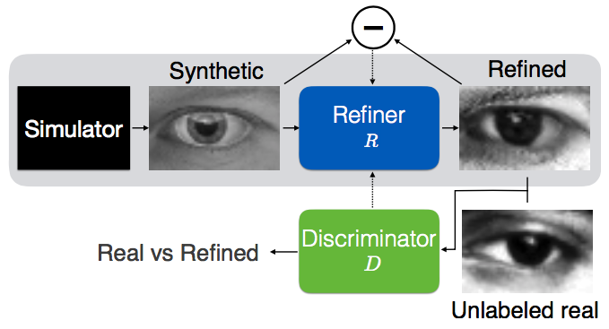
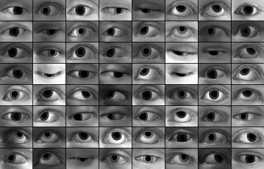
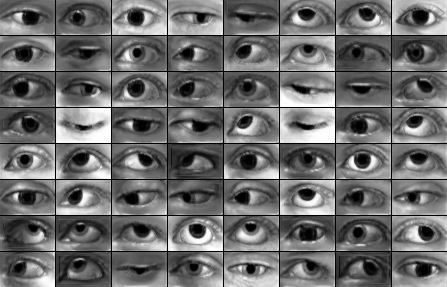
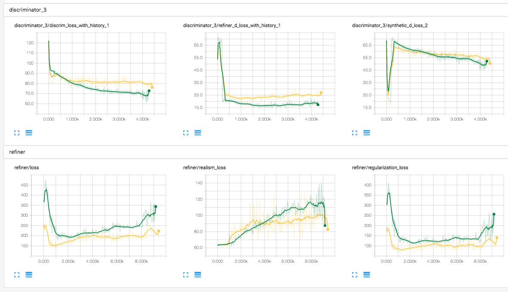
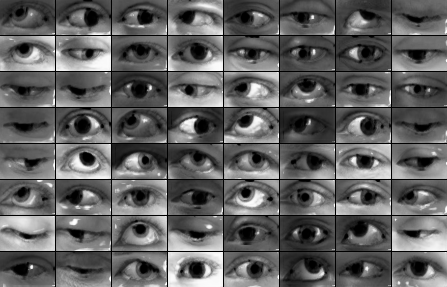
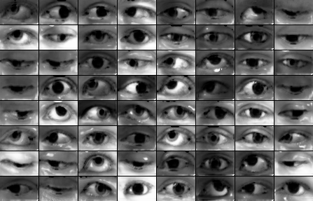
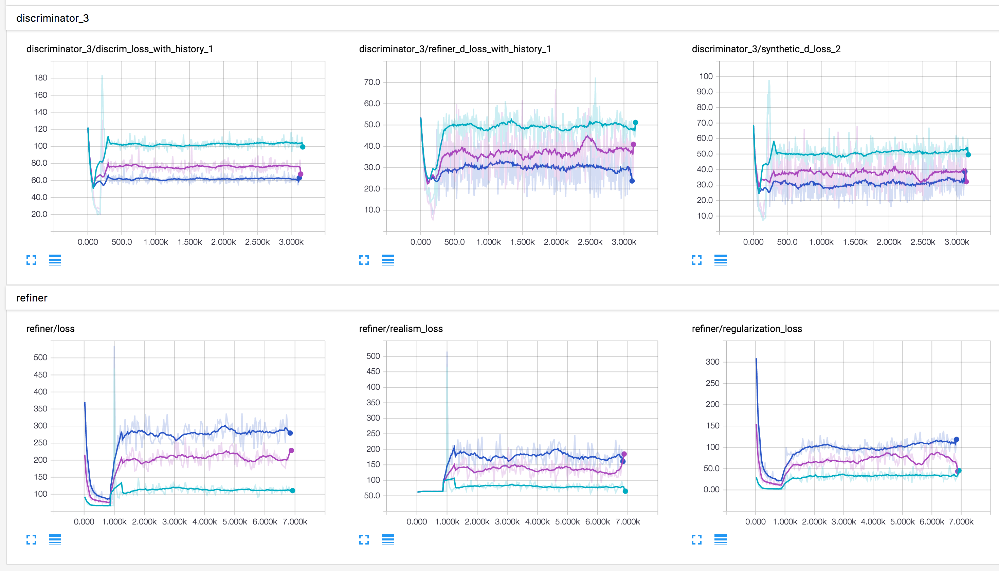

# Simulated+Unsupervised (S+U) Learning in TensorFlow

TensorFlow implementation of [Learning from Simulated and Unsupervised Images through Adversarial Training](https://arxiv.org/abs/1612.07828).

## Requirements

- Python 2.7
- [TensorFlow](https://www.tensorflow.org/) 0.12.1
- [SciPy](http://www.scipy.org/install.html)
- [pillow](https://github.com/python-pillow/Pillow)
- [tqdm](https://github.com/tqdm/tqdm)

## Usage

To generate synthetic dataset:

1. Run [UnityEyes](http://www.cl.cam.ac.uk/research/rainbow/projects/unityeyes/) with changing `resolution` to `640x480` and `Camera parameters` to `[0, 0, 20, 40]`.
2. Move generated images and json files into `data/gaze/UnityEyes`.

The `data` directory should looks like:

    data
    ├── gaze
    │   ├── MPIIGaze
    │   │   └── Data
    │   │       └── Normalized
    │   │           ├── p00
    │   │           ├── p01
    │   │           └── ...
    │   └── UnityEyes # contains images of UnityEyes
    │       ├── 1.jpg
    │       ├── 1.json
    │       ├── 2.jpg
    │       ├── 2.json
    │       └── ...
    ├── __init__.py
    ├── gaze_data.py
    ├── hand_data.py
    └── utils.py

To train a model (samples will be generated in `samples` directory):

    $ python main.py
    $ tensorboard --logdir=logs --host=0.0.0.0

To refine all synthetic images with a pretrained model:

    $ python main.py --is_train=False --synthetic_image_dir="./data/gaze/UnityEyes/"

## Training results

### Differences with the paper

- Used Adam and Stochatstic Gradient Descent optimizer.
- Only used 83K (14% of 1.2M used by the paper) synthetic images from `UnityEyes`.
- Manually choose hyperparameters for `B` and `lambda` because those are not specified in the paper.

### Experiments #1

For these synthetic images,

Result of `lambda=1.0` with `optimizer=sgd` after 8,000 steps.

    $ python main.py --reg_scale=1.0 --optimizer=sgd

Result of `lambda=0.5` with `optimizer=sgd` after 8,000 steps.

    $ python main.py --reg_scale=0.5 --optimizer=sgd

Training loss of discriminator and refiner when `lambda` is `1.0` (green) and `0.5` (yellow).

### Experiments #2

For these synthetic images,

Result of `lambda=1.0` with `optimizer=adam` after 4,000 steps.

    $ python main.py --reg_scale=1.0 --optimizer=adam

Result of `lambda=0.5` with `optimizer=adam` after 4,000 steps.

    $ python main.py --reg_scale=0.5 --optimizer=adam

Result of `lambda=0.1` with `optimizer=adam` after 4,000 steps.

    $ python main.py --reg_scale=0.1 --optimizer=adam

Training loss of discriminator and refiner when `lambda` is `1.0` (blue), `0.5` (purple) and `0.1` (green).

## Author

Taehoon Kim / [@carpedm20](http://carpedm20.github.io)
